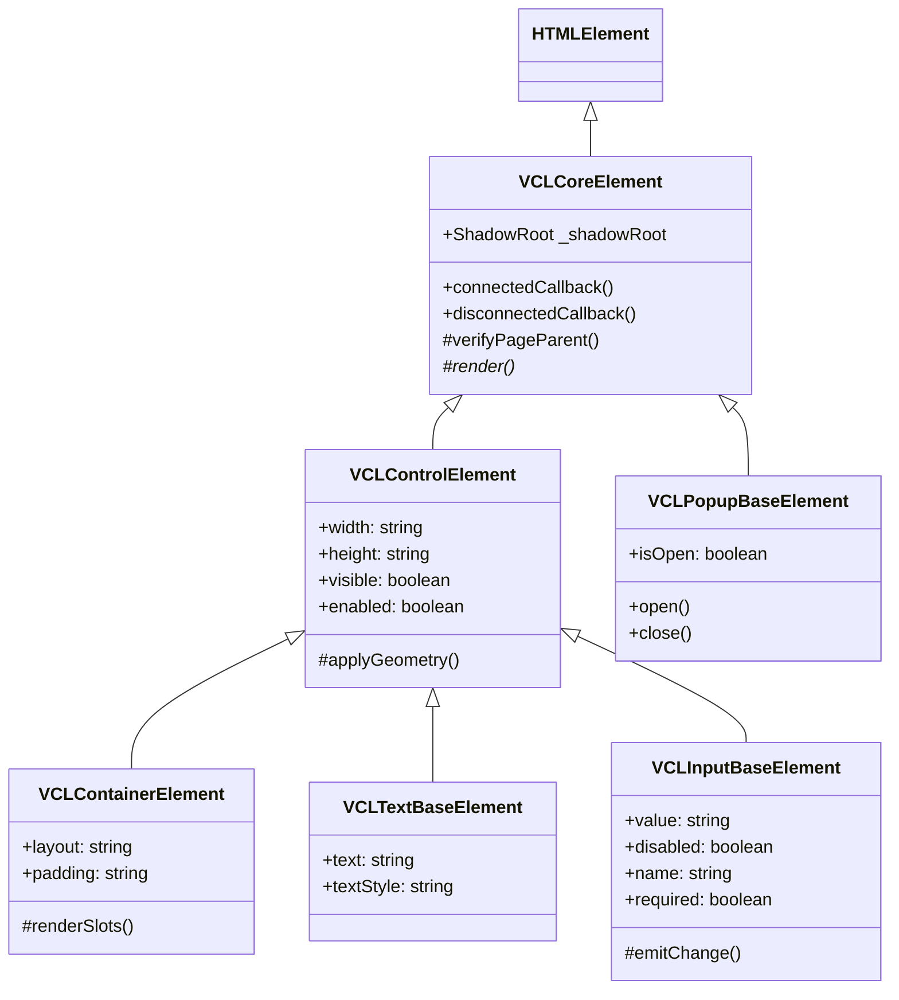

# ⚡ VCL.JS — Framework Moderno de Web Components Empresariales

[](package.json)
[](tsconfig.json)
[](vite.config.ts)
[](https://www.w3.org/TR/custom-elements/)
[](https://www.w3.org/TR/shadow-dom/)
[](web-components/index.ts)
[](LICENSE)

**VCL.JS** es una suite completa de **Web Components Nativos de HTML5** (`Custom Elements v1` + `Shadow DOM v1`) diseñada para el desarrollo rápido de aplicaciones web empresariales (**RAD**), inspirada en la clásica arquitectura de componentes de Delphi y C++Builder.

Desarrollada de forma moderna y limpia en **TypeScript**, ofrece componentes autocontenidos con aislamiento total de estilos mediante **Shadow DOM**, ranuras nativas de composición (`<slot>`), cero dependencias en tiempo de ejecución (**100% Zero jQuery**) y comunicación reactiva a través de **Custom Events**.

---

## 🌟 Principales Características

- 🚀 **100% Zero JQuery**: Rendimiento óptimo sin librerías intermedias; manipulaciones directas sobre el DOM nativo estándar.
- 🛡️ **W3C Custom Elements v1 & Shadow DOM v1**: Encapsulamiento real del árbol DOM y aislamiento total de CSS sin colisiones de nombres.
- 🏗️ **Arquitectura Jerárquica Delphi VCL**: Herencia orientada a objetos en TypeScript estructurada en clases base reutilizables (`VCLCoreElement` → `VCLControlElement` → `VCLContainerElement`, `VCLInputBaseElement`, `VCLTextBaseElement`, `VCLPopupBaseElement`).
- 📄 **Regla del Contenedor Raíz `<vcl-page>`**: Marco de aplicación estructurado que gobierna los márgenes, diseño adaptativo y ciclo de vida de los componentes hijos.
- 📡 **Sistema Unificado de Eventos (`vcl-*`)**: Comunicación desacoplada mediante `CustomEvent` que atraviesa la frontera del Shadow DOM (`composed: true`, `bubbles: true`).
- 🎨 **Estilos Encapsulados y Variables CSS**: Tematización limpia y consistente con soporte para temas claros, oscuros y paletas de acento.
- ⚡ **Tooling Moderno**: Compilación ultrarrápida impulsada por **Vite 5** y **TypeScript 5**, compatible con cualquier framework (Vanilla JS, React, Vue, Angular, Svelte) o páginas HTML estándar.
- 🧪 **Interactive Test Bed Harness**: Entorno interactivo de pruebas en tiempo real con monitoreo de eventos en vivo para cada componente.

---

## 🏛️ Jerarquía Arquitectónica de Clases (Core)

Todos los componentes heredan de una base común modular ubicada en [`web-components/core/`](file:///c:/Users/roman/GitHub/VCL.JS/web-components/core/):



### Descripción de Clases Base

| Clase Base | Rol y Responsabilidad |
| :--- | :--- |
| `VCLCoreElement` | Inicializa el `ShadowRoot` en modo abierto, ciclo de vida W3C y verificación del contenedor ancestro `<vcl-page>`. |
| `VCLControlElement` | Control de visibilidad, habilitación/deshabilitación, dimensiones y geometría de visualización. |
| `VCLContainerElement` | Soporte para composición de hijos mediante `<slot>`, gestión de layouts y anidamiento. |
| `VCLInputBaseElement` | Manejo de formularios, valores, validación, foco y eventos de entrada/cambio (`vcl-change`). |
| `VCLTextBaseElement` | Propiedades tipográficas, variantes visuales y formateo de texto. |
| `VCLPopupBaseElement` | Manejo de capas flotantes, z-index, superposiciones y modales. |

---

## 📦 Catálogo de Web Components Disponibles

### 1. Contenedores y Layout
- **`<vcl-page>`**: Contenedor principal de aplicación y vistas. Requerido como contenedor ancestro.
- **`<vcl-panel>`**: Paneles modulares con soporte de cabecera, pie de panel y estilos contextuales.
- **`<vcl-well>`**: Contenedores tipo tarjeta con borde sutil para agrupar contenido.
- **`<vcl-row>` & `<vcl-col>`**: Sistema de grilla flexible responsive para maquetación rápida.
- **`<vcl-tabpanel>` & `<vcl-tabsheet>`**: Pestañas de navegación e intercambio dinámico de paneles de contenido.
- **`<vcl-accordion>` & `<vcl-accordion-group>`**: Paneles colapsables y expandibles en acordeón.

### 2. Controles de Formulario e Interacción
- **`<vcl-button>`**: Botones con soporte de estados, estilos (`primary`, `success`, `danger`, `warning`, `info`) y deshabilitado.
- **`<vcl-input>`**: Campo de texto estándar reactivo con placeholder y sincronización de valor.
- **`<vcl-input-numeric>`**: Entrada numérica controlada con soporte de incrementos, decrementos y validación.
- **`<vcl-textarea>`**: Área de texto multilinea enriquecida.
- **`<vcl-checkbox>`**: Casillas de verificación con soporte para estado activo, inactivo e indeterminado.
- **`<vcl-radiobutton>`**: Botones de opción con soporte de grupos mutuamente excluyentes.
- **`<vcl-combobox>`**: Listas desplegables con soporte de items y selección reactiva.
- **`<vcl-listbox>`**: Listas de selección múltiple o simple con scroll integrado.
- **`<vcl-toggleswitch>`**: Interruptores tipo switch on/off interactivos.
- **`<vcl-typeahead>`**: Campo de autocompletado y búsqueda predictiva en tiempo real.

### 3. Navegación y Barras de Herramientas
- **`<vcl-navbar>`**: Barra de navegación superior con soporte de logo, enlaces y acciones.
- **`<vcl-sidebar>`**: Barra lateral retráctil para menús de navegación complejos.
- **`<vcl-toolbar>` & `<vcl-toolbutton>`**: Barras de herramientas con botones de acción rápida, íconos y separadores.
- **`<vcl-breadcrumb>` & `<vcl-breadcrumb-item>`**: Migas de pan jerárquicas para ubicación del usuario.
- **`<vcl-pagination>`**: Control de paginación interactivo con botones anterior/siguiente y páginas numeradas.
- **`<vcl-statusbar>` & `<vcl-statuspanel>`**: Barra de estado inferior multi-panel con soporte de autosize e íconos.

### 4. Visualización de Datos, Árboles y Listas
- **`<vcl-treeview>` & `<vcl-treenode>`**: Árbol jerárquico multinivel con expansión, contracción y selección de nodos.
- **`<vcl-listview>` & `<vcl-listcolumn>`**: Vista de datos tabular/lista con columnas configurables y ordenamiento.

### 5. Feedback, Diálogos e Información
- **`<vcl-badge>`**: Insignias informativas de conteo y estado.
- **`<vcl-alert>`**: Mensajes y notificaciones de alerta dismissibles (`success`, `warning`, `danger`, `info`).
- **`<vcl-progressbar>`**: Barras de progreso con soporte de animación, porcentajes e indeterminación.
- **`<vcl-modal>`**: Diálogos modales con backdrop, títulos y pie de acciones.
- **`<vcl-label>` & `<vcl-text>`**: Etiquetas y textos formateados con tipografía estandarizada.
- **`<vcl-image>` & `<vcl-icon>`**: Renderizadores de imágenes optimizadas y pictogramas vectoriales.

---

## 🛠️ Comandos de Desarrollo y Ejecución

### Requisitos
- **Node.js** v18+
- **npm** (incluido con Node.js)

### Scripts Disponibles en `package.json`

```bash
# 1. Instalar dependencias
npm install

# 2. Iniciar el servidor de desarrollo Vite
npm run dev

# 3. Iniciar el Test Bed Harness interactivo
npm run testbed

# 4. Compilar la versión de producción optimizada en /dist
npm run build

# 5. Previsualizar localmente el build de producción
npm run preview
```

---

## 💻 Guía de Uso y Ejemplos

### 1. Declaración Básica en HTML

> [!IMPORTANT]
> **Regla de Oro**: Todos los componentes deben estar contenidos dentro de un elemento `<vcl-page>` como padre ancestro obligatorio.

```html
<!DOCTYPE html>
<html lang="es">
<head>
    <meta charset="UTF-8">
    <meta name="viewport" content="width=device-width, initial-scale=1.0">
    <title>Aplicación VCL.JS</title>
</head>
<body>

    <!-- Contenedor Raíz Obligatorio -->
    <vcl-page title="Sistema de Gestión VCL">

        <!-- Barra de Herramientas -->
        <vcl-toolbar>
            <vcl-toolbutton id="btn-nuevo" text="Nuevo"></vcl-toolbutton>
            <vcl-toolbutton id="btn-guardar" text="Guardar"></vcl-toolbutton>
            <vcl-toolbutton id="btn-eliminar" text="Eliminar"></vcl-toolbutton>
        </vcl-toolbar>

        <!-- Panel con Formulario -->
        <vcl-panel header-title="Datos del Cliente" panel-style="primary">
            <vcl-row>
                <vcl-col span="6">
                    <vcl-label text="Nombre Completo:"></vcl-label>
                    <vcl-input id="txt-nombre" placeholder="Ingrese nombre..."></vcl-input>
                </vcl-col>
                <vcl-col span="6">
                    <vcl-label text="Monto Límite:"></vcl-label>
                    <vcl-input-numeric id="num-limite" value="1500" min="0" max="10000"></vcl-input-numeric>
                </vcl-col>
            </vcl-row>

            <div style="margin-top: 15px; display: flex; gap: 10px;">
                <vcl-button id="btn-enviar" text="Procesar Registro" button-style="success"></vcl-button>
                <vcl-badge text="En Línea" badge-style="success"></vcl-badge>
            </div>
        </vcl-panel>

        <!-- Barra de Estado -->
        <vcl-statusbar>
            <vcl-statuspanel text="Listo" width="120"></vcl-statuspanel>
            <vcl-statuspanel text="Registros: 1,420" width="160"></vcl-statuspanel>
            <vcl-statuspanel text="Servidor: Conectado"></vcl-statuspanel>
        </vcl-statusbar>

    </vcl-page>

    <!-- Importar biblioteca de componentes -->
    <script type="module" src="/web-components/index.ts"></script>
</body>
</html>
```

---

### 2. Manejo de Eventos Nativos (JavaScript / TypeScript)

La comunicación se gestiona sin intermediarios mediante `addEventListener` y eventos estándar `vcl-*`:

```typescript
// Importar componentes si se utiliza un empaquetador
import '/web-components/index.ts';

// 1. Escuchar clic en botón (<vcl-button>, <vcl-toolbutton>)
const btnEnviar = document.getElementById('btn-enviar');
btnEnviar?.addEventListener('vcl-click', (e: CustomEvent) => {
    console.log('Botón presionado:', e.detail);
});

// 2. Escuchar cambios de valor en entradas (<vcl-input>, <vcl-input-numeric>, <vcl-combobox>)
const txtNombre = document.getElementById('txt-nombre');
txtNombre?.addEventListener('vcl-change', (e: CustomEvent) => {
    console.log('Nuevo valor ingresado:', e.detail.value);
});

// 3. Modificación reactiva de atributos mediante el DOM nativo
const badge = document.querySelector('vcl-badge');
badge?.setAttribute('text', 'Guardado con éxito');
badge?.setAttribute('badge-style', 'primary');
```

---

## 🧪 Banco de Pruebas Interactivo (`testbed/`)

El directorio [`testbed/`](file:///c:/Users/roman/GitHub/VCL.JS/testbed) contiene un banco de pruebas visual con monitoreo de eventos en vivo y suites individuales para cada componente:

| Banco de Prueba | Archivo | Descripción |
| :--- | :--- | :--- |
| **Suite General** | `index.html` / `testbed/index.html` | Panel interactivo principal con consola de eventos en tiempo real. |
| **Pestañas & Tabs** | `testbed/test-vcl-tabpanel.html` | Pestañas superiores, inferiores, estilo pills y tabsheets dinámicos. |
| **Toolbar & Notepad** | `testbed/test-vcl-toolbar.html` | Aplicación interactiva Notepad con barra horizontal, vertical y control de densidad. |
| **Árboles (TreeView)** | `testbed/test-vcl-treeview.html` | Explorador jerárquico de carpetas y archivos con selección de nodos. |
| **Vistas de Lista (ListView)** | `testbed/test-vcl-listview.html` | Gestor de tareas tabular con ordenamiento por columnas y selección. |
| **Barra de Estado** | `testbed/test-vcl-statusbar.html` | Barra de estado interactiva estilo IDE con paneles ajustables. |
| **Barra de Progreso** | `testbed/test-vcl-progressbar.html` | Progreso animado, porcentajes, variantes de color e indeterminación. |
| **Modales y Diálogos** | `testbed/test-vcl-modal.html` | Diálogos con backdrop y comportamiento modal estricto. |
| **Acordeones y Alertas** | `testbed/test-vcl-accordion.html`, `testbed/test-vcl-alert.html` | Paneles colapsables y notificaciones emergentes. |

---

## 📁 Estructura del Repositorio

```text
VCL.JS/
├── docs/                       # Guías y plan maestro de conversión
│   └── CONVERSION_PLAN.md      # Lista de verificación y mapeo de componentes
├── testbed/                    # Entorno interactivo de pruebas y suites HTML
│   ├── index.html              # Test Bed principal con terminal de eventos
│   ├── test-vcl-toolbar.html   # Test suite de Toolbar y ToolButtons
│   ├── test-vcl-treeview.html  # Test suite de TreeView
│   ├── test-vcl-listview.html  # Test suite de ListView
│   ├── test-vcl-statusbar.html # Test suite de StatusBar
│   └── test-vcl-tabpanel.html  # Test suite de TabPanel y TabSheets
├── web-components/             # Código fuente de VCL.JS (W3C Web Components)
│   ├── core/                   # Clases base (VCLCoreElement, VCLControlElement, etc.)
│   ├── containers/             # Contenedores raíz (vcl-page)
│   ├── components/             # Catálogo de componentes individuales
│   │   ├── accordion/          # <vcl-accordion>, <vcl-accordion-group>
│   │   ├── button/             # <vcl-button>
│   │   ├── input/              # <vcl-input>
│   │   ├── listview/           # <vcl-listview>, <vcl-listcolumn>
│   │   ├── modal/              # <vcl-modal>
│   │   ├── navigation/         # <vcl-navbar>, <vcl-sidebar>
│   │   ├── tabpanel/           # <vcl-tabpanel>, <vcl-tabsheet>
│   │   ├── toolbar/            # <vcl-toolbar>, <vcl-toolbutton>
│   │   ├── treeview/           # <vcl-treeview>, <vcl-treenode>
│   │   └── ...                 # Demás componentes de interfaz
│   └── index.ts                # Punto de entrada y exportación de componentes
├── index.html                  # Test Bed raíz para desarrollo rápido
├── package.json                # Configuración del proyecto, scripts y dependencias
├── tsconfig.json               # Configuración del compilador TypeScript
└── vite.config.ts              # Configuración del servidor y empaquetador Vite
```

---

## 📜 Reconocimiento

Este proyecto ha sido desarrollado y trabajado sobre la base del proyecto de https://github.com/vclteam/VCL.JS.
